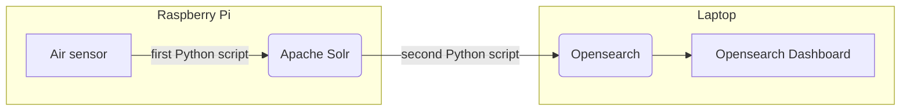

# air-quality

As a small project I decided to visualize the air quality in my office. I combined a few interesting pieces of tech and over-engineered a system that solves this simple task.
Because I wanted to learn more about it, I decided to base the system on Opensearch and use Opensearch Dashboard for the visualization.

The air sensor which I am using can be hooked up via usb and identifies itself as `Holtek Semiconductor, Inc. USB-zyTemp`. There is a [Python library](https://github.com/heinemml/CO2Meter) 
that can be used to read the values both for CO2 and temperature. To run the code I wanted to use a Raspberry Pi 3. This led to the problem that there is no version of Opensearch available
for the Pi. I could run Opensearch on some other computer and send the data there but I don't have any other computer running permanently at the office. Instead I installed Solr on the Pi 
and use it to store the air quality data as JSON using a [first Python script](co2.py). On my work laptop I use a docker image of Opensearch and Opensearch Dashboard to analyze and visualize
the data. To sync the data between Solr and Opensearch I use a [second Python script](solrsync.py) on the laptop. It only copies new data created after the timestamp of the most recent document in Opensearch. Finally, in Opensearch Dashboard you can create a new visualization that uses aggregations on the data, e.g. maximum to show both co2 and temperature over time.
The final architecture is the following:

